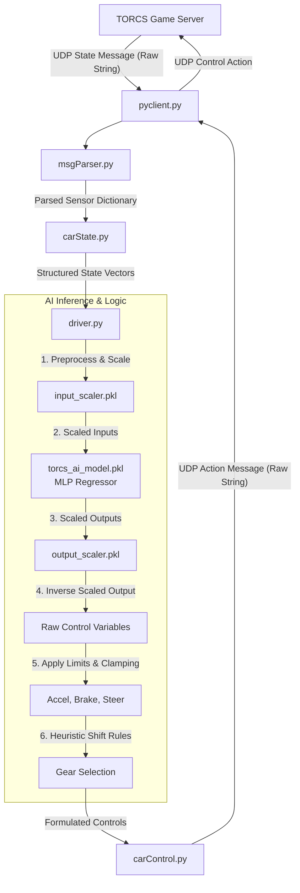

# 🏎️ TORCS AI Driver: Neural Network Racing Agent

[](https://www.python.org/)
[](https://scikit-learn.org/)
[](https://sourceforge.net/projects/torcs/)
[](https://opensource.org/licenses/MIT)

An advanced autonomous driving agent designed to race in **TORCS (The Open Racing Car Simulator)**. The agent connects to the **SCRC (Simulated Car Racing Championship)** server via UDP, parses real-time telemetry and track sensor data, feeds it through a trained Multi-Layer Perceptron (MLP) Neural Network, and controls the car (acceleration, braking, steering) dynamically.

---

## 📌 Table of Contents
1. [System Architecture](#-system-architecture)
2. [Directory Structure](#-directory-structure)
3. [How It Works](#-how-it-works)
    - [Model Input Features](#1-model-input-features-30-dimensions)
    - [Neural Network Architecture](#2-neural-network-architecture)
    - [Control Output Targets](#3-control-output-targets)
    - [Heuristic Gear-Shifting Logic](#4-heuristic-gear-shifting-logic)
4. [Installation & Setup](#-installation--setup)
5. [Training the Model](#-training-the-model)
6. [Running the Autonomous Agent](#-running-the-autonomous-agent)
7. [License](#-license)

---

## 🏗️ System Architecture

The driving loop runs in real-time over a local UDP connection. The interaction sequence is visualized below:



---

## 📂 Directory Structure

Here is a breakdown of the repository files:

```bash
AI_Final/
├── __pycache__/            # Compiled Python bytecode cache
├── carControl.py           # Class container representing car actuation controls
├── carState.py             # Class container parsing & representing car sensor data
├── driver.py               # Core driving agent combining ML prediction & heuristic gear shifting
├── model.py                # Script to preprocess telemetry CSVs and train the neural network
├── msgParser.py            # Custom parser formatting UDP messages between client and server
├── pyclient.py             # UDP socket communication client to interface with SCRC server
├── requirements.txt        # Required python package dependencies
├── .gitignore              # Git ignore rules for cached, runtime, and telemetry data
├── torcs_ai_model.pkl      # Trained MLP Neural Network model binary
├── input_scaler.pkl        # Fitted scikit-learn standard scaler for input features
└── output_scaler.pkl       # Fitted scikit-learn standard scaler for output targets
```

---

## ⚙️ How It Works

### 1. Model Input Features (30 Dimensions)
The model receives the current physical state of the vehicle and distance to track boundaries:
*   **Velocities (`SpeedX`, `SpeedY`, `SpeedZ`)**: The longitudinal, transverse, and vertical speeds of the car (m/s).
*   **Car orientation (`Angle`)**: The angle between the car's direction and the track axis.
*   **Engine status (`RPM`, `Gear`)**: Engine revolutions per minute and current gear.
*   **Track alignment (`TrackPosition`)**: Distance of the car from the track center (0 = center, -1 = left edge, 1 = right edge).
*   **Track Range Sensors (`Track_1` to `Track_19`)**: 19 range sensors checking the distance to track edges in 19 directions spanning -90° to +90°.
*   **Wheel dynamics (`WheelSpinVelocity_1` to `WheelSpinVelocity_4`)**: Rotational speeds of all four wheels.

### 2. Neural Network Architecture
The brain of the agent is a Multi-Layer Perceptron (MLP) Regressor trained using `scikit-learn`:
*   **Hidden Layers**: `(64, 64)` structure (two hidden layers, each with 64 neurons).
*   **Activation Function**: ReLU (Rectified Linear Unit) for non-linearity.
*   **Solver**: Adam (a stochastic gradient-based optimizer).
*   **Scaling**: All inputs and outputs are scaled to unit variance (`StandardScaler`) to prevent inputs with larger magnitudes (like RPM) from dominating the learning process.

### 3. Control Output Targets
The neural network outputs continuous predictions for physical controls, which are then inverse-scaled and clamped to valid bounds:
*   **Acceleration (`accel`)**: Clamped to `[0.0, 1.0]`.
*   **Braking (`brake`)**: Clamped to `[0.0, 1.0]`.
*   **Steering (`steer`)**: Clamped to `[-1.0, 1.0]` (where `-1.0` is max right, `1.0` is max left).

### 4. Heuristic Gear-Shifting Logic
Since gear selection is a discrete task, the client overrides the MLP gear output with a robust rule-based engine:
*   **Neutral-to-First**: If the gear is `0` (neutral), shift immediately to `1`.
*   **Upshifting**: Shift up if engine RPM exceeds **8,000 RPM** and current gear is less than 6.
*   **Downshifting**: Shift down if engine RPM falls below **3,000 RPM** and current gear is greater than 1.
*   **Anti-Stall**: Automatically force downshift to gear 1 if horizontal speed drops below **5.0 m/s**.

---

## 🔧 Installation & Setup

1.  **Clone the Repository**:
    ```bash
    git clone https://github.com/your-username/torcs-ai-driver.git
    cd torcs-ai-driver
    ```

2.  **Set up Virtual Environment (Recommended)**:
    ```bash
    python -m venv venv
    # On Windows:
    venv\Scripts\activate
    # On macOS/Linux:
    source venv/bin/activate
    ```

3.  **Install Dependencies**:
    ```bash
    pip install -r requirements.txt
    ```

---

## 🏋️ Training the Model

If you wish to re-train the model using your own driving telemetry data:

1.  Place your recorded TORCS telemetry CSV files in the project root directory. The training script expects files named:
    *   `1.csv`, `2.csv`, `3.csv`, `4.csv`, `5.csv`, `6.csv`, `7.csv`, `11.csv`, `12.csv`, `13.csv`
2.  Run the training script:
    ```bash
    python model.py
    ```
3.  The script will:
    *   Load and concatenate the dataset.
    *   Clean NaN values and remove irrelevant metrics (e.g., fuel level, damage, race position).
    *   Fit standard input and output scalers.
    *   Train the MLP neural network (displaying the validation Mean Squared Error).
    *   Overwrite `torcs_ai_model.pkl`, `input_scaler.pkl`, and `output_scaler.pkl`.

---

## 🚀 Running the Autonomous Agent

Ensure you have your **TORCS simulator with the SCRC server running** on your system.

To connect your Python client to the racing server:

```bash
python pyclient.py --host localhost --port 3001 --id SCR --maxEpisodes 1
```

### CLI Arguments:
| Argument | Description | Default |
| :--- | :--- | :--- |
| `--host` | IP address of the TORCS server | `localhost` |
| `--port` | Port of the SCRC server | `3001` |
| `--id` | Identification name of the agent | `SCR` |
| `--maxEpisodes` | Number of episodes/races to complete | `1` |
| `--maxSteps` | Maximum simulation steps per episode (0 = infinite) | `0` |
| `--stage` | Simulator stage environment indicator | `3` |

---

## 📄 License
This project is licensed under the MIT License - see the [LICENSE](LICENSE) file for details.
